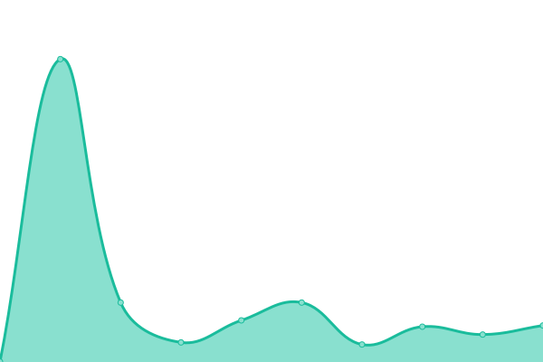
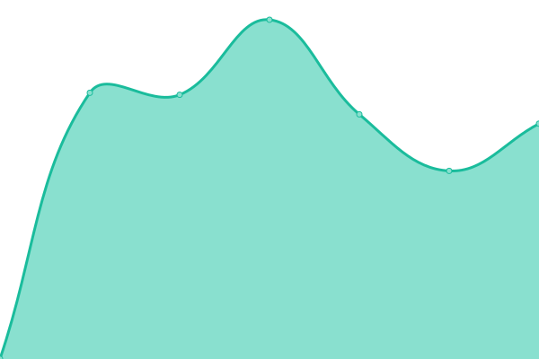
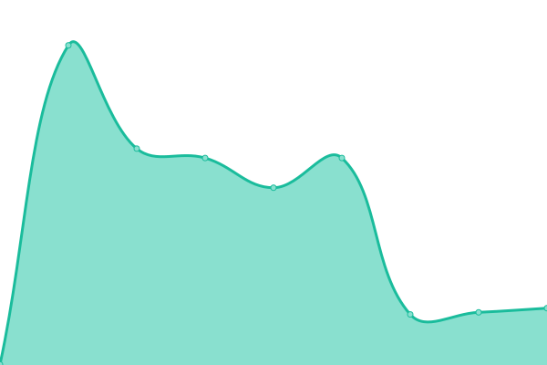

# [📈 Live Status](https://status.thatconference.com): <!--live status--> **🟧 Partial outage**

This repository contains the open-source uptime monitor and status page for [THAT Conference](https://www.thatconference.com), powered by [Upptime](https://github.com/upptime/upptime).

With [Upptime](https://upptime.js.org), you can get your own unlimited and free uptime monitor and status page, powered entirely by a GitHub repository. We use [Issues](https://github.com/thatconference/status/issues) as incident reports, [Actions](https://github.com/thatconference/status/actions) as uptime monitors, and [Pages](https://status.thatconference.com) for the status page.

<!--start: status pages-->
<!-- This summary is generated by Upptime (https://github.com/upptime/upptime) -->
<!-- Do not edit this manually, your changes will be overwritten -->

| URL                                               | Status  | History                                                                                                    | Response Time                                                                         | Uptime                                                                                                                                                                                                                               |
| ------------------------------------------------- | ------- | ---------------------------------------------------------------------------------------------------------- | ------------------------------------------------------------------------------------- | ------------------------------------------------------------------------------------------------------------------------------------------------------------------------------------------------------------------------------------ |
| [THAT.us](https://that.us/activities)             | 🟩 Up   | [that-us.yml](https://github.com/ThatConference/status/commits/master/history/that-us.yml)                 |  341ms          |                  |
| [THAT Conference](https://www.thatconference.com) | 🟩 Up   | [that-conference.yml](https://github.com/ThatConference/status/commits/master/history/that-conference.yml) |  1552ms |  |
| [THAT API](https://api.that.tech)                 | 🟥 Down | [that-api.yml](https://github.com/ThatConference/status/commits/master/history/that-api.yml)               |  603ms         |                  |
| THAT API 2                                        | 🟩 Up   | [that-api-2.yml](https://github.com/ThatConference/status/commits/master/history/that-api-2.yml)           |  97ms        |             |

<!--end: status pages-->

[**Visit our status website →**](https://status.thatconference.com)

## 📄 License

- Powered by: [Upptime](https://github.com/upptime/upptime)
- Code: [MIT](./LICENSE) © [THAT Conference](https://www.thatconference.com)
- Data in the `./history` directory: [Open Database License](https://opendatacommons.org/licenses/odbl/1-0/)
