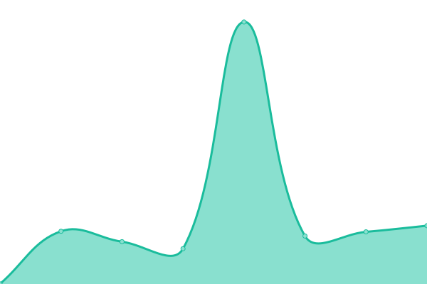
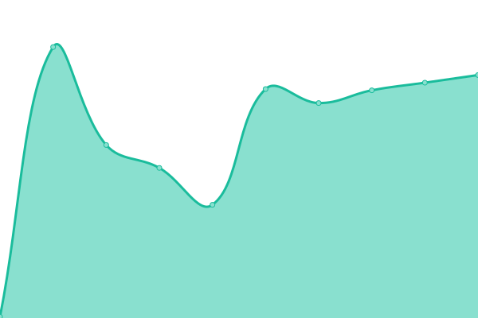
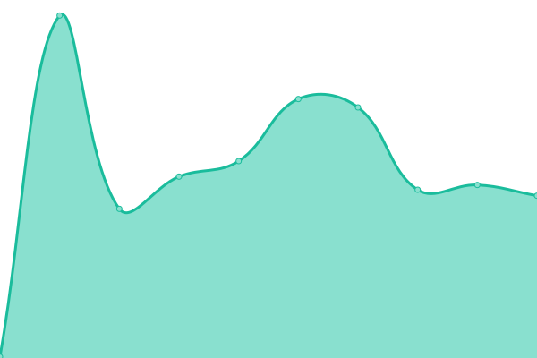
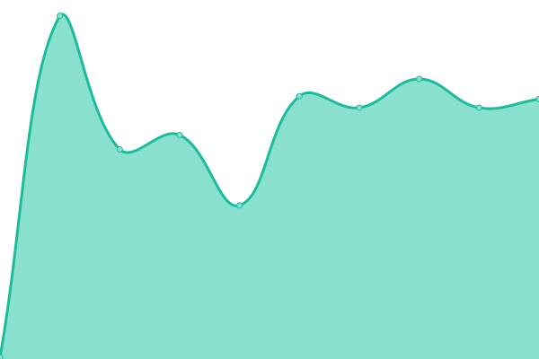
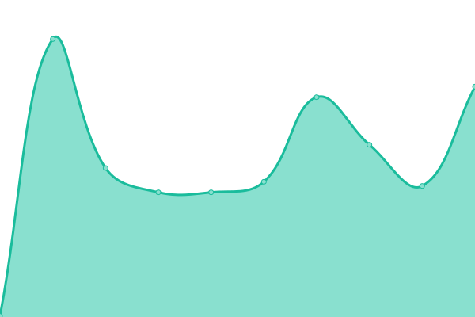

# [📈 Live Status](https://status.that.tech): <!--live status--> **🟩 All systems operational**

This repository contains the open-source uptime monitor and status page for [THAT Conference](https://www.thatconference.com), [THAT.us](https://that.us), and the API, powered by [Upptime](https://github.com/upptime/upptime).

With [Upptime](https://upptime.js.org), you can get your own unlimited and free uptime monitor and status page, powered entirely by a GitHub repository. We use [Issues](https://github.com/thatconference/status/issues) as incident reports, [Actions](https://github.com/thatconference/status/actions) as uptime monitors, and [Pages](https://status.thatconference.com) for the status page.

<!--start: status pages-->
<!-- This summary is generated by Upptime (https://github.com/upptime/upptime) -->
<!-- Do not edit this manually, your changes will be overwritten -->
<!-- prettier-ignore -->
| URL | Status | History | Response Time | Uptime |
| --- | ------ | ------- | ------------- | ------ |
|  [THAT.us](https://that.us/activities) | 🟩 Up | [that-us.yml](https://github.com/ThatConference/status/commits/master/history/that-us.yml) | 

 231ms
     
 | 

<a href="https://status.that.tech/history/that-us">100.00%</a>
    

|  [THATconference.com](https://www.thatconference.com) | 🟩 Up | [tha-tconference-com.yml](https://github.com/ThatConference/status/commits/master/history/tha-tconference-com.yml) | 

 1177ms
     
 | 

<a href="https://status.that.tech/history/tha-tconference-com">100.00%</a>
    

|  API Gateway | 🟩 Up | [api-gateway.yml](https://github.com/ThatConference/status/commits/master/history/api-gateway.yml) | 

 1524ms
     
 | 

<a href="https://status.that.tech/history/api-gateway">100.00%</a>
    

|  API Events | 🟩 Up | [api-events.yml](https://github.com/ThatConference/status/commits/master/history/api-events.yml) | 

 166ms
     
 | 

<a href="https://status.that.tech/history/api-events">100.00%</a>
    

|  API Members | 🟩 Up | [api-members.yml](https://github.com/ThatConference/status/commits/master/history/api-members.yml) | 

 167ms
     
 | 

<a href="https://status.that.tech/history/api-members">100.00%</a>
    

|  API Partners | 🟩 Up | [api-partners.yml](https://github.com/ThatConference/status/commits/master/history/api-partners.yml) | 

 265ms
     
 | 

<a href="https://status.that.tech/history/api-partners">100.00%</a>
    

|  API SESSIONS | 🟩 Up | [api-sessions.yml](https://github.com/ThatConference/status/commits/master/history/api-sessions.yml) | 

 181ms
     
 | 

<a href="https://status.that.tech/history/api-sessions">100.00%</a>
    

|  API GARAGE | 🟩 Up | [api-garage.yml](https://github.com/ThatConference/status/commits/master/history/api-garage.yml) | 

 347ms
     
 | 

<a href="https://status.that.tech/history/api-garage">100.00%</a>
    

<!--end: status pages-->

[**Visit our status website →**](https://status.that.tech)

## 📄 License

- Powered by: [Upptime](https://github.com/upptime/upptime)
- Code: [MIT](./LICENSE) © [THAT Conference](https://www.thatconference.com)
- Data in the `./history` directory: [Open Database License](https://opendatacommons.org/licenses/odbl/1-0/)
